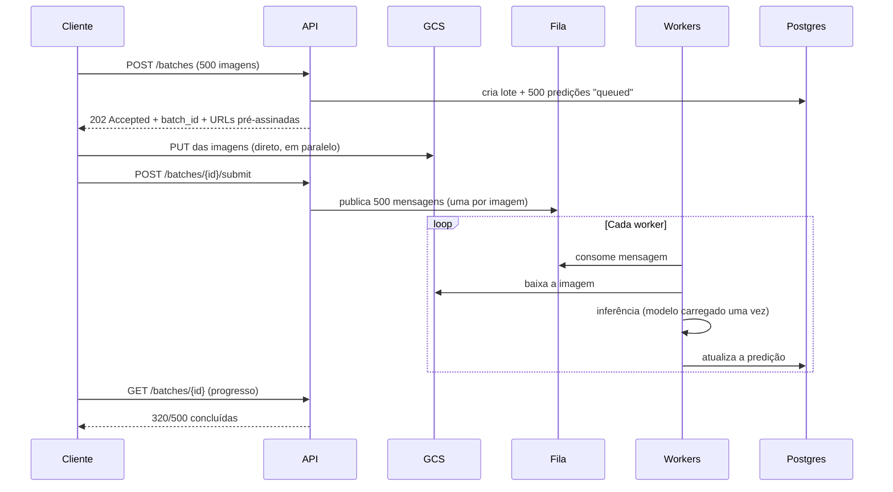

# drone-image-processing

Prova prática de Back-end João Victor Volpato.

---

## Parte 1: Objetivo de cada componente do diagrama

### 1. Camada externa

| Componente | Objetivo |
|---|---|
| **Drone** | Capturar as mídias (fotos e vídeos) e gera a telemetria de posição, bateria e status dos sensores. |
| **Controle Remoto** | Controlar as funcionalidades do drone remotamente. |
| **Usuário** | Operar o drone pelo controle remoto e acompanha o voo pelo aplicativo. |
| **Android APP** | Servir a interface que controla o drone e conversa com o back-end: publica a telemetria, recebe os comandos e envia as mídias capturadas. Usa **HTTP** para as requisições e **WebSocket** para receber os eventos em tempo real que vêm do servidor. |

### 2. Camada de entrada

| Componente | Objetivo |
|---|---|
| **Gateway — Kong** | Atuar como ponto único de entrada do sistema, responsável por rotear as requisições para os serviços internos e por concentrar a lógica da plataforma, como TLS, rate limiting e logging. Ele ainda é responsável pela autenticação e identificação do Usuário, o Dispositivo e o Cliente antes que a requisição chegue aos serviços.|

### 3. Camada de aplicação

| Componente | Objetivo |
|---|---|
| **API Java** | Centralizar as regras de negócio da aplicação. Para isso, persiste o estado em MySql, utiliza o Redis como cache e usa o EMQX como broker da mensageria. |
| **API REST** | Componente que abstrai o acesso ao S3. Por meio de uma interface HTTP.|

### 4. Camada de dados e mensageria

| Componente | Objetivo |
|---|---|
| **EMQX** | Servir como canal de comunicação com os dispositivos. Pelo broker passam a telemetria, os eventos e as respostas de comando, e é ele que desacopla o dispositivo do back-end. |
| **MySql** | Armazenar dados transacionais referente ao estado regras de negócio, como usuários, dispositivos, logs de voo e metadados das mídias. |
| **Redis** | Armazenar em memória para os dados que são acessados/alterados com frequência, antes de escrever ou ler do MySql|
| **Storage S3** | Guarda as mídias do drone, que são arquivos grandes e imutáveis, com durabilidade alta e custo baixo por GB.  |

### 5. Camada de observabilidade

| Componente | Objetivo |
|---|---|
| **Prometheus** | Coletar e armazenar as métricas dos serviços, como latência, taxa de erro, throughput e conexões no EMQX, e avalia as regras de alerta em cima delas. |
| **Grafana** | Montar e mostrar os dashboards sobre as métricas do Prometheus, dando visão da saúde da plataforma, dos drones conectados e do desempenho das APIs. |
| **Técnico** | Operar a plataforma. É quem acompanha o sistema pelo Grafana e pelo dashboard do EMQX para diagnosticar dispositivos e investigar incidentes. |


---

## Parte 2: API RESTful de missões

CRUD de missões em FastAPI, com persistência em SQLite. A emissão do token é
responsabilidade do serviço de autenticação; esta API apenas valida o JWT recebido.

### Como rodar

O projeto usa [uv](https://docs.astral.sh/uv/) e Python 3.13.

```bash
cp .env.example .env
uv sync
uv run uvicorn src.main:app --reload   # docs em http://localhost:8000/docs
uv run pytest                          # testes
```

Como não há login aqui, para testar basta um token assinado com o mesmo `JWT_SECRET`
que o serviço de autenticação usaria:

```bash
TOKEN=$(uv run python -c "
import jwt, datetime as dt
now = dt.datetime.now(dt.timezone.utc)
print(jwt.encode({'sub': 'user-123', 'username': 'piloto', 'iat': now,
                  'exp': now + dt.timedelta(hours=1)}, 'change-me-in-production'))")

curl -X POST localhost:8000/missions \
  -H "Authorization: Bearer $TOKEN" -H 'Content-Type: application/json' \
  -d '{"name":"Talhão 12","drone_model":"DJI Mavic 3M","image_count":500,"area_hectares":12.5}'
```

### Endpoints

| Método | Rota | Descrição |
|---|---|---|
| `GET` | `/auth/me` | Identidade extraída do token atual |
| `GET` | `/health` | Saúde da API e do banco (pública) |
| `POST` | `/missions` | Cria uma missão |
| `GET` | `/missions/{id}` | Busca uma missão pelo id |
| `PATCH` | `/missions/{id}` | Edição parcial |
| `DELETE` | `/missions/{id}` | Remove uma missão |

### Organização do código

```
src/
├── domain/       entidades, erros e as portas de persistência
├── api/          rotas, schemas, middleware e injeção de dependência
├── service/      regras de negócio, atrás de interfaces
└── repository/   SQL, driver do banco e mapeamento para o domínio
```

O fluxo é `api -> service -> repository -> banco` e as dependências apontam para dentro:
o service depende da interface `IMissionRepository`, que fica no domínio, e é a
implementação SQL que depende do domínio. O `domain/` não importa nada das outras camadas.


## Parte 3: Integração de modelos de IA

`POST /predictions` recebe a solicitação, valida os parâmetros, roda a inferência com um
modelo já treinado e grava a execução no histórico.

O modelo é um **SSD MobileNet v1** (COCO) em ONNX, versionado em `models/`. A escolha foi
por simplicidade: ONNX Runtime roda bem em CPU e a imagem Docker fica na casa das centenas de MB. O modelo está atrás da interface `IInferenceEngine`, então trocá-lo não toca em service nem em rota.

### Requisição

```bash
curl -X POST localhost:8000/predictions \
  -H "Authorization: Bearer $TOKEN" -H 'Content-Type: application/json' \
  -d '{
        "image_key": "missao-12/frame-0001.png",
        "mission_id": "…",
        "model_version": null,
        "confidence_threshold": 0.25,
        "request_id": "req-123"
      }'
```

A imagem é referenciada por **chave**, não enviada no corpo: é o mesmo desenho da Questão 5,
em que o arquivo vai direto para o storage e a API recebe só o ponteiro. As imagens ficam em
`IMAGES_ROOT` (`data/images` por padrão); em produção, esse adaptador seria o microsserviço
que abstrai o S3.

| Método | Rota | Descrição |
|---|---|---|
| `POST` | `/predictions` | Processa uma imagem |
| `GET` | `/predictions` | Histórico, com filtro por `mission_id` |
| `GET` | `/predictions/{id}` | Uma execução específica |
| `GET` | `/models` | Versões disponíveis e a ativa |

### Como cada requisito foi atendido

**Modelo carregado apenas uma vez.** `OnnxModelRegistry` mantém as sessões em cache por
versão e é memorizado por processo, então o carregamento acontece uma vez — no lifespan,
não na primeira requisição.

**Tratamento de erro.** Cada falha tem um erro de domínio próprio e vira um status
distinto: imagem inexistente `404`, versão de modelo desconhecida `422`, arquivo que não é
imagem `422`, falha dentro do runtime `500`. Toda falha é gravada no histórico com
`status=failed` e a mensagem — erro que não deixa registro não é observável.

**Tempo de inferência.** Medido com `perf_counter` em volta **apenas** da chamada ao
modelo, separado do tempo total da requisição.

**Versionamento.** `models/manifest.json` declara as versões, o arquivo de cada uma, as
labels e qual é a ativa. `model_version` vazio na requisição usa a ativa, e a versão
efetivamente usada é gravada em toda predição — sem isso não há como explicar por que a
mesma imagem deu resultados diferentes em datas diferentes.

**Histórico das predições.** Tabela `predictions` com a solicitação, o resultado, os tempos
e o erro. 

### Limite conhecido

A inferência roda em `asyncio.to_thread`, porque é CPU-bound e travaria o event loop se
rodasse direto na rota. A solução real é tirar o
processamento da API e passá-lo para um worker consumindo fila — que é exatamente o desenho
descrito nas respostas das Questões 3 e 4.
<<<<<<< HEAD
=======
<<<<<<< Updated upstream
=======
>>>>>>> 8b537d7 (docs adding part 5 answers)

---

## Parte 4: Docker e orquestração de contêineres

```bash
cp .env.example .env
docker compose up --build     # API em http://localhost:8000
```

O compose sobe três serviços: **api**, **postgres** e **redis**.

### O que foi feito

**Containerização.** Base `python:3.13-slim-trixie` (Debian 13) e `Dockerfile` em dois estágios: o primeiro resolve as dependências com
`uv sync --frozen`, o segundo recebe apenas o virtualenv e o código. As dependências ficam
em uma camada própria, antes do `COPY` do código, então mudar um arquivo Python não refaz a
instalação. O processo roda como usuário `app`, sem privilégios.

**Event loop.** O container sobe com `--loop uvloop --http httptools`. O `uvicorn[standard]`
já traz os dois e o padrão `--loop auto` os escolheria sozinho; declarar explicitamente evita
cair no asyncio puro em silêncio se o extra deixar de ser instalado. O log da subida informa
qual loop está em uso.

**Variáveis de ambiente.** Toda configuração vem do ambiente, via `Settings` do
pydantic-settings — nada de host, senha ou segredo no código. O compose usa
`${VAR:-default}`, de modo que `docker compose up` funciona sem `.env`, mas qualquer valor
pode ser sobrescrito.

**Healthcheck.** `/health` verifica banco e cache de verdade, e é o que o `HEALTHCHECK` do
Dockerfile e o do compose consultam. Um container que responde mas perdeu o banco aparece
como `unhealthy`, que é o comportamento que um orquestrador precisa para substituir a
réplica.

**Esperar o banco.** Duas camadas. No compose, `depends_on: condition: service_healthy`
segura a API até o `pg_isready` do Postgres passar. Na aplicação, `connect_with_retry`
tenta conectar por até 30 vezes com intervalo de 1s — isso cobre o caso de o banco reiniciar
depois da subida, quando o orquestrador não tem mais nada a segurar.

**PostgreSQL.** O driver virou um contrato (`Database`) com duas implementações:
`SQLiteDatabase` e `PostgresDatabase`, esta última com pool de conexões do asyncpg. Os
repositories continuam escrevendo o mesmo SQL — a tradução dos placeholders `?` para o `$n`
do asyncpg fica dentro do driver. É a promessa da Parte 2 sendo cobrada: trocar de banco
não tocou em service nem em domínio.

### Por que utilizar Redis neste cenário?

1) Cache distribuido garantindo idempotência entre replicas. E para controle de uso da api distribuido, como um semafaro ou mutex entre as replicas. 
2) A implementação do Redis Queue para desacoplar a inferência do modelo de ML da API.
3) Cache de leitura dos dados das predições.


### Como escalaria a aplicação para processar milhares de imagens simultaneamente?

Construindo uma API que recebe as requsições de processamento, mas não processa diretamente. Publica as requisições de processamento em um fila, onde um pool de workers (doployments k8s) consomem a fila e realizam a inferência. Idealmente esse pool de workers seria escalável a partir de métricas da propria fila, utilizando KEDA por exemplo. 


### Como faria o deploy em AWS?

Resposta de deploy na GCP:

Setup de um GKE para deployment das images e replicas.
Com um script de CD no google cloud build, que faz o build da imagem, salva no artifact registry e commita a troca da imagem no deployment yaml do servico.
O banco de dados fica fora do K8S numa instância do Cloud SQL (Postgres na GCP).
O redis vira um pod dentro da node pool.
As imagens dos processamentos seriam guardadas no GCS (bucket).
Os segredos da aplicação ficam guardados no secret manager e injetados via env-var no deploy.


### Como desacoplaria o processamento pesado da API?

`POST /predictions` deixaria de executar a inferência diretamente. Ele passaria a validar os parâmetros,
escrever os jobs de inferência numa fila e retornar o status como `queued`,  **202 Accepted** com o id.
O cliente passa a acompanhar por um novo endpoint o satatus do processamento `GET /predictions/{id}`, ou por websocket/SSE.

Do outro lado, um worker consome a fila, carrega o modelo uma vez, roda a inferência e
atualiza o mesmo registro de histórico. As garantias vêm da fila: retentativa com backoff,
DLQ para o que falha de forma persistente e visibility timeout para que uma mensagem em
processamento não seja entregue duas vezes — apoiada pela idempotência por `request_id` que
já existe.

No código atual, isso é uma implementação nova de `IPredictionService`: a rota, os schemas
e o repositório de histórico continuam iguais, porque a interface não muda. O que muda é
quem executa a inferência, e quando.


---

## Parte 5: Questões extras

### Questão 4 — Um usuário envia 500 imagens e o processamento leva vários minutos

A regra que organiza todo o resto: **nenhuma requisição HTTP fica aberta esperando o
processamento**. A API aceita o trabalho, devolve um identificador e o cliente acompanha o
progresso por outro caminho.



**Uma mensagem por imagem, não por lote.** Assim as 500 imagens são processadas em
paralelo por quantos workers existirem, uma falha isolada não derruba o lote inteiro e a
retentativa reprocessa só o que falhou. O lote vira apenas um agregador de contadores.

**O cliente acompanha por polling ou callback.** `GET /batches/{id}` devolve os contadores
por status; para volume maior, um webhook ao final ou o WebSocket que o gateway do diagrama
da Parte 1 já expõe. Polling é o mais simples e resolve a maioria dos casos.


### Questão 5 — Upload de uma imagem de 2 GB não deve passar pela API

**A API entrega uma credencial, não recebe bytes.** O cliente pede a permissão de upload, a
API valida quem ele é e responde com uma URL pré-assinada; o cliente envia o arquivo direto
para o GCS.

Sempre carregando os seguintes parametros:
- `content-length-range`, para o cliente não subir um arquivo de 50 GB;
- `content-type` restrito;


### Questão 6 — Como impedir que um usuário baixe imagens de outro cliente


1. O tenant vem do token, nunca do request.** Cada imagem, missão e predição guardaria o
`client_id` do dono. O `client_id` usado nas consultas sai do JWT validado, e o parâmetro
que o cliente manda serve só para filtrar dentro do que já é dele.

4. Responder 404, não 403.** Para recurso de outro cliente, "não encontrado" evita
confirmar que o id existe. `403` já é informação para quem está enumerando ids.

